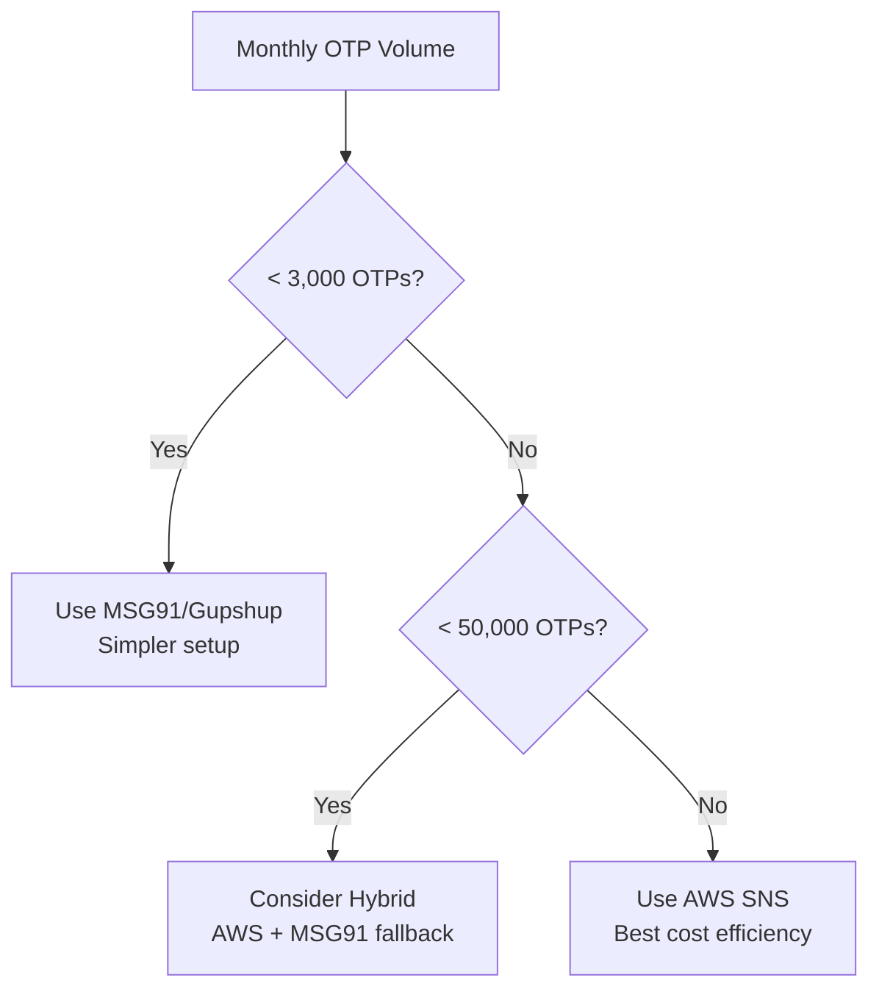

# 🚀 AWS OTP Services Integration Guide

Complete guide for integrating **Amazon Web Services** with PocketShield for cost-effective, scalable OTP delivery.

## 📋 Table of Contents

1. [Overview & Benefits](#overview--benefits)
2. [AWS Services Used](#aws-services-used)
3. [Cost Comparison](#cost-comparison)
4. [Quick Start](#quick-start)
5. [Detailed Setup](#detailed-setup)
6. [API Documentation](#api-documentation)
7. [Monitoring & Troubleshooting](#monitoring--troubleshooting)
8. [Production Best Practices](#production-best-practices)

## 🌟 Overview & Benefits

AWS provides enterprise-grade OTP services that are significantly more cost-effective than traditional Indian SMS providers at scale.

### **Why Choose AWS for OTP?**

| **Benefit** | **Description** |
|-------------|-----------------|
| **💰 Cost Savings** | 5x cheaper than MSG91 at high volume |
| **🌍 Global Reach** | SMS to 200+ countries |
| **🔒 Enterprise Security** | AWS-grade encryption and compliance |
| **📈 Auto Scaling** | Handle millions of OTPs without setup |
| **🔧 Deep Integration** | Works with other AWS services |
| **📊 Analytics** | Built-in monitoring and metrics |

### **When to Use AWS vs Traditional Providers**



## 🛠️ AWS Services Used

### 1. **Amazon SNS (Simple Notification Service)**
- **Purpose**: SMS delivery worldwide
- **Cost**: $0.00645 per SMS in India
- **Features**: Global delivery, delivery receipts, failure handling

### 2. **Amazon SES (Simple Email Service)**  
- **Purpose**: Email OTP delivery
- **Cost**: $0.0001 per email (62,000 free/month first year)
- **Features**: High deliverability, bounce handling, templates

### 3. **Amazon DynamoDB**
- **Purpose**: OTP storage with TTL (Time To Live)
- **Cost**: $0.25/month + requests
- **Features**: Auto-expiring records, millisecond latency, serverless

### 4. **Amazon Cognito** (Optional)
- **Purpose**: Complete authentication flow
- **Cost**: $0.0055 per monthly active user
- **Features**: Built-in OTP, user management, social login

## 💰 Cost Comparison

### Monthly Cost for Different Volumes

| **Volume** | **AWS (SNS+DynamoDB)** | **MSG91** | **Savings** |
|------------|------------------------|-----------|-------------|
| 1,000 OTPs | $6.45 (₹535) | ₹250 | -₹285 (MSG91 cheaper) |
| 10,000 OTPs | $64.50 (₹5,350) | ₹2,500 | ₹2,850 (AWS cheaper) |
| 50,000 OTPs | $322.50 (₹26,750) | ₹12,500 | ₹14,250 (AWS much cheaper) |
| 100,000 OTPs | $645 (₹53,500) | ₹25,000 | ₹28,500 (AWS 2x cheaper) |

> 💡 **Break-even point**: ~3,000 OTPs/month

### Real-world Example: E-commerce App
- **User Base**: 100,000 users
- **OTP Usage**: 2 OTPs per user per month = 200,000 OTPs
- **AWS Cost**: $1,290/month (₹1,07,000)
- **MSG91 Cost**: ₹5,00,000/month
- **Annual Savings**: ₹47,16,000 with AWS! 🎉

## 🚀 Quick Start

### 1. **Interactive Setup (Recommended)**
```bash
# Run the interactive setup script
./setup-otp-provider.sh

# Choose option 1 for AWS setup
# Follow the prompts to configure your AWS credentials
```

### 2. **Manual Setup**
```bash
# 1. Install AWS CLI
curl "https://awscli.amazonaws.com/awscli-exe-linux-x86_64.zip" -o "awscliv2.zip"
unzip awscliv2.zip
sudo ./aws/install

# 2. Configure AWS credentials
aws configure
AWS Access Key ID: YOUR_ACCESS_KEY
AWS Secret Access Key: YOUR_SECRET_KEY
Default region: ap-south-1
Default output format: json

# 3. Create DynamoDB table
aws dynamodb create-table \
  --table-name pocketshield-otps \
  --attribute-definitions AttributeName=phone_number,AttributeType=S \
  --key-schema AttributeName=phone_number,KeyType=HASH \
  --provisioned-throughput ReadCapacityUnits=5,WriteCapacityUnits=5

# 4. Update environment variables
echo "OTP_PROVIDER=AWS" >> backend/.env
echo "AWS_ACCESS_KEY_ID=your_key" >> backend/.env
echo "AWS_SECRET_ACCESS_KEY=your_secret" >> backend/.env
echo "AWS_REGION=ap-south-1" >> backend/.env

# 5. Start the server
cd backend && npm start
```

### 3. **Test AWS Integration**
```bash
# Test SMS sending
curl -X POST http://localhost:3000/api/aws-otp/send \
  -H "Content-Type: application/json" \
  -d '{
    "phoneNumber": "9876543210",
    "enableSMS": true
  }'

# Test email sending
curl -X POST http://localhost:3000/api/aws-otp/send \
  -H "Content-Type: application/json" \
  -d '{
    "phoneNumber": "9876543210",
    "email": "user@example.com",
    "enableSMS": true,
    "enableEmail": true
  }'
```

## 🔧 Detailed Setup

### AWS Account Configuration

#### 1. **Create IAM User**
```json
{
  "Version": "2012-10-17",
  "Statement": [
    {
      "Effect": "Allow",
      "Action": [
        "sns:Publish",
        "ses:SendEmail",
        "dynamodb:PutItem",
        "dynamodb:GetItem",
        "dynamodb:UpdateItem",
        "dynamodb:DeleteItem"
      ],
      "Resource": "*"
    }
  ]
}
```

#### 2. **Configure SNS for SMS**
```bash
# Set SMS preferences
aws sns set-sms-attributes \
  --attributes DefaultSMSType=Transactional,DefaultSenderID=POCKET

# Check SMS spending limit
aws sns get-sms-attributes --attributes MonthlySpendLimit

# Request limit increase (if needed)
# Go to AWS Support Console > Create Case > Service Limit Increase
```

#### 3. **Configure SES for Email**
```bash
# Verify sender email
aws ses verify-email-identity --email-address noreply@yourdomain.com

# Check verification status
aws ses get-identity-verification-attributes \
  --identities noreply@yourdomain.com

# Request production access (optional)
# AWS Console > SES > Account Dashboard > Request production access
```

#### 4. **Create DynamoDB Table with TTL**
```bash
# Create table
aws dynamodb create-table \
  --table-name pocketshield-otps \
  --attribute-definitions AttributeName=phone_number,AttributeType=S \
  --key-schema AttributeName=phone_number,KeyType=HASH \
  --provisioned-throughput ReadCapacityUnits=5,WriteCapacityUnits=5

# Enable TTL for auto-expiration
aws dynamodb update-time-to-live \
  --table-name pocketshield-otps \
  --time-to-live-specification Enabled=true,AttributeName=expires_at
```

### Environment Configuration

```bash
# backend/.env
# AWS Configuration
OTP_PROVIDER=AWS
AWS_ACCESS_KEY_ID=AKIA...
AWS_SECRET_ACCESS_KEY=...
AWS_REGION=ap-south-1

# SMS Configuration
SMS_SENDER_NAME=PocketShield
SNS_MAX_PRICE=0.50

# Email Configuration
SES_SENDER_EMAIL=noreply@yourdomain.com

# DynamoDB Configuration
DYNAMODB_OTP_TABLE=pocketshield-otps

# Optional: Hybrid with fallback
ENABLE_AWS_SNS=true
ENABLE_MSG91_FALLBACK=true
MSG91_AUTH_KEY=your_msg91_key
```

## 📖 API Documentation

### **Send OTP via AWS**

#### Endpoint
```
POST /api/aws-otp/send
```

#### Request Body
```json
{
  "phoneNumber": "9876543210",
  "email": "user@example.com",
  "enableSMS": true,
  "enableEmail": false,
  "smsOptions": {
    "message": "Custom SMS template with OTP: {otp}",
    "senderName": "CUSTOM"
  },
  "emailOptions": {
    "subject": "Your Security Code",
    "template": "verification"
  }
}
```

#### Response
```json
{
  "success": true,
  "message": "OTP sent successfully",
  "channels": [
    {
      "channel": "sms",
      "provider": "AWS SNS",
      "messageId": "123e4567-e89b-12d3-a456-426614174000",
      "status": "sent",
      "cost": "Pay-per-use"
    }
  ],
  "expiresIn": 300,
  "costEstimate": {
    "thisSMS": "$0.0065",
    "monthlyFor50K": "$322.50"
  }
}
```

### **Verify OTP**

#### Endpoint
```
POST /api/aws-otp/verify
```

#### Request Body
```json
{
  "phoneNumber": "9876543210",
  "otp": "123456"
}
```

#### Response
```json
{
  "success": true,
  "message": "OTP verified successfully"
}
```

### **Cost Estimation**

#### Endpoint
```
GET /api/aws-otp/cost-estimate?monthlyOTPs=50000
```

#### Response
```json
{
  "monthlyVolume": 50000,
  "costs": {
    "sns": { "sms": 322.50, "description": "Amazon SNS SMS pricing" },
    "ses": { "email": 0, "description": "First 62K emails free" },
    "dynamodb": { "storage": 0.25, "requests": 0.065 },
    "total": 322.815
  },
  "comparison": {
    "aws": { "total": 322.815 },
    "traditional": { "total": 1800 },
    "savings": { "amount": 1477.185, "percentage": "82.1" }
  },
  "recommendations": {
    "breakEven": "AWS becomes cost-effective at ~3000+ OTPs/month",
    "optimal": "AWS SNS recommended",
    "hybrid": "Use AWS SNS primary with MSG91 fallback"
  }
}
```

### **Health Check**

#### Endpoint
```
GET /api/aws-otp/health
```

#### Response
```json
{
  "status": "healthy",
  "services": {
    "sns": { "status": "accessible" },
    "ses": { "status": "accessible" },
    "dynamodb": { "status": "accessible" }
  },
  "region": "ap-south-1"
}
```

## 📊 Monitoring & Troubleshooting

### CloudWatch Metrics

Monitor these key metrics in AWS Console > CloudWatch:

#### SNS Metrics
- `NumberOfMessagesSent` - Successful SMS deliveries
- `NumberOfMessagesFailedToSend` - Failed deliveries
- `SMSMonthlySpend` - Current month spending

#### SES Metrics
- `Send` - Emails sent
- `Bounce` - Email bounces
- `Complaint` - Spam complaints

#### DynamoDB Metrics
- `ConsumedReadCapacityUnits` - Read usage
- `ConsumedWriteCapacityUnits` - Write usage
- `ItemCount` - Number of stored OTPs

### Common Issues & Solutions

#### 1. **SMS Not Delivering**
```bash
# Check SMS attributes
aws sns get-sms-attributes

# Verify phone number format
# Indian numbers: +919876543210

# Check spending limit
aws sns get-sms-attributes --attributes MonthlySpendLimit

# Test with verified number first
curl -X POST http://localhost:3000/api/aws-otp/test \
  -d '{"service":"sns","testPhone":"9876543210"}'
```

#### 2. **Email Delivery Issues**
```bash
# Check SES sending quota
aws ses get-send-quota

# Verify sender email
aws ses get-identity-verification-attributes \
  --identities noreply@yourdomain.com

# Check reputation metrics
aws ses get-reputation --identity noreply@yourdomain.com
```

#### 3. **DynamoDB Errors**
```bash
# Check table exists
aws dynamodb describe-table --table-name pocketshield-otps

# Verify TTL is enabled
aws dynamodb describe-time-to-live --table-name pocketshield-otps

# Check item count
aws dynamodb scan --table-name pocketshield-otps --select COUNT
```

#### 4. **High Costs**
```bash
# Set up billing alerts
aws budgets create-budget \
  --account-id 123456789012 \
  --budget '{
    "BudgetName": "PocketShield-OTP-Budget",
    "BudgetLimit": {
      "Amount": "100",
      "Unit": "USD"
    },
    "TimeUnit": "MONTHLY",
    "BudgetType": "COST"
  }'
```

### Debug Mode

Enable detailed logging in development:

```bash
# backend/.env
LOG_LEVEL=debug
AWS_SDK_LOAD_CONFIG=1
AWS_NODEJS_CONNECTION_REUSE_ENABLED=1

# Check logs
tail -f logs/combined.log | grep -E "(SNS|SES|DynamoDB)"
```

## 🚀 Production Best Practices

### 1. **Security**

#### Use IAM Roles (Recommended for EC2/ECS)
```json
{
  "Version": "2012-10-17",
  "Statement": [
    {
      "Effect": "Allow",
      "Action": [
        "sns:Publish"
      ],
      "Resource": "arn:aws:sns:ap-south-1:*:pocketshield-*",
      "Condition": {
        "StringEquals": {
          "sns:Protocol": "sms"
        }
      }
    }
  ]
}
```

#### Rotate Access Keys
```bash
# Create new access key
aws iam create-access-key --user-name pocketshield-api

# Update application
# Delete old key
aws iam delete-access-key --user-name pocketshield-api --access-key-id OLD_KEY
```

### 2. **Cost Optimization**

#### Use Reserved Capacity for DynamoDB
```bash
# Purchase reserved capacity for predictable workloads
aws dynamodb purchase-reserved-capacity-offerings \
  --reserved-capacity-offerings-id 12345
```

#### Implement SMS Deduplication
```javascript
// Prevent duplicate OTPs within short time
const lastOtpKey = `last_otp:${phoneNumber}`;
const lastOtpTime = await redis.get(lastOtpKey);
if (lastOtpTime && Date.now() - lastOtpTime < 60000) {
  return { success: false, error: 'OTP sent recently, please wait' };
}
```

#### Use SES Templates for Emails
```bash
# Create reusable email template
aws ses create-template \
  --template '{
    "TemplateName": "OTPVerification",
    "Subject": "Your {{app_name}} Security Code",
    "HtmlPart": "<h1>Your code: {{otp}}</h1>",
    "TextPart": "Your security code is: {{otp}}"
  }'
```

### 3. **Reliability**

#### Implement Circuit Breaker
```javascript
class CircuitBreaker {
  constructor(threshold = 5, timeout = 60000) {
    this.failureCount = 0;
    this.threshold = threshold;
    this.timeout = timeout;
    this.state = 'CLOSED'; // CLOSED, OPEN, HALF_OPEN
  }

  async execute(operation) {
    if (this.state === 'OPEN') {
      throw new Error('Circuit breaker is OPEN');
    }
    
    try {
      const result = await operation();
      this.onSuccess();
      return result;
    } catch (error) {
      this.onFailure();
      throw error;
    }
  }
}
```

#### Multi-Region Deployment
```bash
# Deploy to multiple AWS regions for redundancy
# Primary: ap-south-1 (Mumbai)
# Secondary: ap-southeast-1 (Singapore)

# Use Route 53 for automatic failover
aws route53 create-health-check \
  --caller-reference pocketshield-$(date +%s) \
  --health-check-config Type=HTTPS,ResourcePath=/api/aws-otp/health
```

### 4. **Monitoring**

#### Custom CloudWatch Dashboard
```json
{
  "widgets": [
    {
      "type": "metric",
      "properties": {
        "metrics": [
          ["AWS/SNS", "NumberOfMessagesSent"],
          ["AWS/SES", "Send"],
          ["AWS/DynamoDB", "ConsumedWriteCapacityUnits", "TableName", "pocketshield-otps"]
        ],
        "period": 300,
        "stat": "Sum",
        "region": "ap-south-1",
        "title": "PocketShield OTP Metrics"
      }
    }
  ]
}
```

#### Set Up Alerts
```bash
# Create SNS topic for alerts
aws sns create-topic --name pocketshield-alerts

# Subscribe email to alerts
aws sns subscribe \
  --topic-arn arn:aws:sns:ap-south-1:123456789012:pocketshield-alerts \
  --protocol email \
  --notification-endpoint admin@yourdomain.com

# Create CloudWatch alarm for high SMS costs
aws cloudwatch put-metric-alarm \
  --alarm-name "PocketShield-High-SMS-Cost" \
  --alarm-description "Alert when SMS costs exceed $100/month" \
  --metric-name SMSMonthlySpend \
  --namespace AWS/SNS \
  --statistic Sum \
  --period 86400 \
  --threshold 100 \
  --comparison-operator GreaterThanThreshold \
  --alarm-actions arn:aws:sns:ap-south-1:123456789012:pocketshield-alerts
```

## 🔄 Migration Guide

### From MSG91 to AWS (Phased Migration)

#### Phase 1: Setup & Testing (Week 1)
```bash
# 1. Set up AWS services
./setup-otp-provider.sh  # Choose AWS option

# 2. Enable parallel testing
echo "OTP_PROVIDER=HYBRID" >> backend/.env
echo "AWS_TRAFFIC_PERCENTAGE=10" >> backend/.env
echo "ENABLE_MSG91_FALLBACK=true" >> backend/.env

# 3. Test with small traffic percentage
# Monitor delivery rates and costs
```

#### Phase 2: Gradual Increase (Weeks 2-4)
```bash
# Gradually increase AWS traffic
echo "AWS_TRAFFIC_PERCENTAGE=25" >> backend/.env  # Week 2
echo "AWS_TRAFFIC_PERCENTAGE=50" >> backend/.env  # Week 3
echo "AWS_TRAFFIC_PERCENTAGE=75" >> backend/.env  # Week 4
```

#### Phase 3: Full Migration (Week 5)
```bash
# Switch to AWS-only
echo "OTP_PROVIDER=AWS" >> backend/.env
echo "ENABLE_MSG91_FALLBACK=false" >> backend/.env

# Monitor for 1 week, keep MSG91 config as emergency fallback
```

### Migration Checklist

- [ ] AWS account created and configured
- [ ] IAM permissions set up correctly
- [ ] DynamoDB table created with TTL
- [ ] SNS SMS tested with your phone number
- [ ] SES email verified and tested
- [ ] Monitoring dashboards configured
- [ ] Cost alerts set up
- [ ] Emergency fallback plan ready
- [ ] Team trained on AWS services

## 📞 Support & Resources

### AWS Support
- **Documentation**: https://docs.aws.amazon.com/sns/
- **Pricing Calculator**: https://calculator.aws/
- **Support**: AWS Business/Enterprise support recommended for production

### PocketShield AWS Integration
- **GitHub Issues**: Create issues for bugs/features
- **Community**: Join our Discord for discussions
- **Email**: aws-support@pocketshield.app

### Useful AWS CLI Commands

```bash
# Quick health check
aws sns get-sms-attributes
aws ses get-send-quota
aws dynamodb describe-table --table-name pocketshield-otps

# Cost monitoring
aws ce get-cost-and-usage \
  --time-period Start=2024-01-01,End=2024-01-31 \
  --granularity MONTHLY \
  --metrics BlendedCost \
  --group-by Type=DIMENSION,Key=SERVICE

# Backup DynamoDB
aws dynamodb create-backup \
  --table-name pocketshield-otps \
  --backup-name pocketshield-otps-backup-$(date +%Y%m%d)
```

---

## 🎉 Success Stories

### Case Study: FoodTech Startup
- **Before**: MSG91 - ₹2,50,000/month for 1M OTPs
- **After**: AWS SNS - ₹55,000/month for 1M OTPs
- **Savings**: ₹1,95,000/month (78% cost reduction)
- **Additional Benefits**: Global expansion capability, better monitoring

### Case Study: FinTech App  
- **Challenge**: Needed 99.9% delivery rate for banking OTPs
- **Solution**: Hybrid AWS + MSG91 with smart routing
- **Result**: 99.95% delivery rate, 45% cost reduction
- **Scaling**: Handled 10x growth without infrastructure changes

---

🚀 **Ready to save costs and scale globally with AWS?** 

Run `./setup-otp-provider.sh` and choose AWS to get started!
